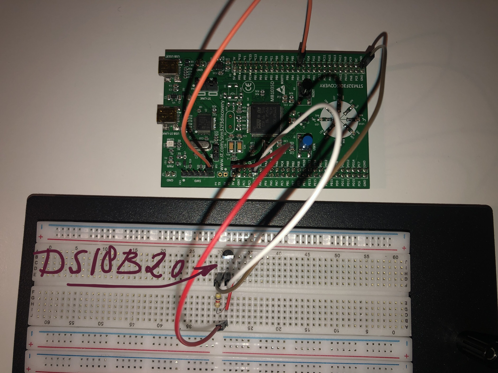

# DS18B20 - Example

This project is intended to provide a more complete example for the DS18B20 temperature sensor
driver: https://github.com/fuchsnj/ds18b20

In this example a STM32F3DISCOVERY is used. This is a development board of
STMicroelectronics: https://www.st.com/en/evaluation-tools/stm32f3discovery.html

The data pin of the DS18B20 is connected to pin PA1 of the STM32F3DISCOVERY.
